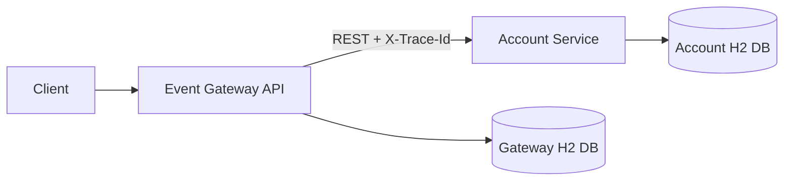
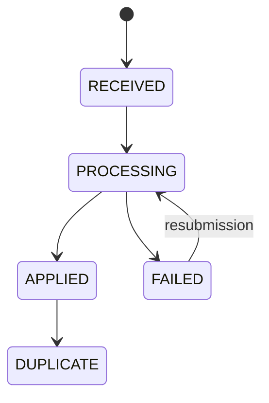

# Event Ledger

Event Ledger is a two-service financial event processing system built to demonstrate correctness, idempotency, resiliency, observability, security, and operational readiness.

## Architecture



- `gateway-service` is public-facing. It validates events, generates or propagates trace IDs, stores event lifecycle state, enforces idempotency, and calls `account-service`.
- `account-service` is internal. It authenticates service-to-service requests, stores accounts and transactions, computes balances, and prevents duplicate transaction application.
- Services are independently deployable and do not share database, cache, memory, or application state.
- Synchronous REST is the only service-to-service communication path.

## Documentation Index

- BMAD PRD: `docs/bmad/prd.md`
- BMAD architecture: `docs/bmad/architecture.md`
- BMAD epics and stories: `docs/bmad/epics.md`, `docs/bmad/stories.md`
- Requirements traceability matrix: `docs/bmad/requirements-traceability.md`
- QA gate: `docs/bmad/qa-gate.md`
- Architecture decision records: `docs/adr/`
- Runbook: `docs/runbook.md`
- Threat model: `docs/threat-model.md`
- Curl examples: `docs/api/event-ledger.http`

## Data Flow

1. Client calls `POST /events`.
2. Gateway validates the payload and creates or propagates `X-Trace-Id`.
3. Gateway stores the event as `RECEIVED`, then marks it `PROCESSING`.
4. Gateway calls Account Service with `X-Trace-Id` and `X-Internal-Api-Key`.
5. Account Service applies the transaction idempotently by `eventId`.
6. Gateway marks the event `APPLIED`, or `FAILED` if Account Service is unavailable.

## Event Lifecycle



Supported statuses are `RECEIVED`, `PROCESSING`, `APPLIED`, `FAILED`, `DUPLICATE`, and `PENDING_RETRY`. This implementation marks unavailable downstream calls as `FAILED`; a future retry worker can move failed events back to `PROCESSING`.

## APIs

Gateway:

- `POST /events`
- `GET /events/{id}`
- `GET /events?account={accountId}`
- `GET /health`
- `GET /metrics`
- Swagger UI: `/swagger-ui/index.html`

Account Service:

- `POST /accounts/{accountId}/transactions`
- `GET /accounts/{accountId}/balance`
- `GET /accounts/{accountId}`
- `GET /health`
- `GET /metrics`
- Swagger UI: `/swagger-ui/index.html`

## Event Payload

```json
{
  "eventId": "evt-001",
  "accountId": "acct-123",
  "type": "CREDIT",
  "amount": 150.00,
  "currency": "USD",
  "eventTimestamp": "2026-05-15T14:02:11Z",
  "metadata": {
    "source": "mainframe-batch",
    "batchId": "B-9042"
  }
}
```

## Domain Rules

- Duplicate `eventId`s do not create duplicate gateway events, duplicate account transactions, or repeated balance updates.
- Event listings are ordered by original `eventTimestamp`, not arrival time.
- Balance is `SUM(CREDIT) - SUM(DEBIT)`.
- Account Service preserves transaction history and maintains a materialized balance for efficient reads.
- Negative balances are allowed. Overdraft controls are intentionally outside this demo boundary.
- Currency support is USD-only. Non-USD events are rejected.
- Account IDs must match `acct-[A-Za-z0-9_-]+`.

## Database Design

Gateway DB:

- `events`
- `UNIQUE(event_id)`
- `INDEX(account_id, event_timestamp)`

Account DB:

- `accounts`
- `transactions`
- `UNIQUE(transactions.event_id)`
- `INDEX(accounts.account_id)`
- `INDEX(transactions.account_id)`

H2 is used for local portability and fast tests. In production, use PostgreSQL with managed migrations, durable storage, connection pooling, and explicit transaction isolation choices.

## Concurrency

- Gateway and Account Service use database uniqueness on `event_id` as the final idempotency guard.
- Account entities use optimistic locking via `@Version`.
- Service write paths are synchronized in-process to keep duplicate concurrent submissions deterministic in this single-instance demo.
- In production, replace in-process serialization with database-level conflict handling, idempotency-key tables, row-level locking or atomic updates, and retry-on-optimistic-lock failure.

## Resiliency

Gateway to Account Service:

- Connection timeout: 1 second
- Read timeout: 2 seconds
- Retry attempts: 3
- Initial backoff: 200 ms
- Exponential multiplier: 2
- Randomized wait enabled
- Circuit breaker failure threshold: 50%
- Minimum calls: 5
- Sliding window size: 10
- Open-state wait duration: 10 seconds
- Half-open permitted calls: 2

Transient failures are treated as retryable. Client and validation failures are non-retryable. When Account Service is unavailable, Gateway persists the event, marks it `FAILED`, and returns a safe 503 problem response instead of hanging or returning a generic 500.

Account balance endpoints live on Account Service in this assignment architecture. If Account Service itself is unreachable, callers receive a clear transport/service-unavailable failure from that service boundary; Gateway-local event reads continue to work because they depend only on Gateway storage.

## Validation And Errors

Both services use Jakarta Bean Validation. Rejected requests include:

- Missing required fields
- Unknown event types
- Amount less than `0.01`
- Invalid account IDs
- Unsupported currencies
- Malformed JSON

Errors follow a Problem Details-style shape:

```json
{
  "type": "https://event-ledger/errors/validation",
  "title": "Validation Failed",
  "status": 400,
  "detail": "amount: must be greater than or equal to 0.01",
  "traceId": "abc123"
}
```

## Security

- Account Service requires `X-Internal-Api-Key`.
- Gateway sends the internal API key from `ACCOUNT_SERVICE_API_KEY`.
- Account Service validates against `INTERNAL_API_KEY`.
- Secrets are provided through environment variables and Docker Compose.
- Request size is limited.
- Safe error responses are returned without stack traces.

## Observability

- JSON logs are emitted through Logback + logstash encoder.
- Logs include service name and MDC trace ID.
- Gateway generates or propagates `X-Trace-Id`.
- Gateway forwards `X-Trace-Id` to Account Service.
- Errors include `traceId`.
- Micrometer exposes Prometheus-compatible metrics.

Primary metrics:

- `events_received_total`
- `events_duplicate_total`
- `events_failed_total`
- `account_transactions_total`
- `account_service_failures_total`
- `account_service_calls_total`

Health checks return service status and database-backed counts.

## Run Locally

```bash
export ACCOUNT_SERVICE_API_KEY=supersecret
docker compose up --build
```

Gateway: `http://localhost:8080`

Account Service: `http://localhost:8081`

## Local API Smoke Test

After Docker Compose starts both services, submit a transaction through Gateway:

```bash
curl -i -X POST http://localhost:8080/events \
  -H "Content-Type: application/json" \
  -H "X-Trace-Id: local-trace-001" \
  -d '{
    "eventId": "evt-local-001",
    "accountId": "acct-local",
    "type": "CREDIT",
    "amount": 150.00,
    "currency": "USD",
    "eventTimestamp": "2026-05-15T14:02:11Z",
    "metadata": {
      "source": "local-curl"
    }
  }'
```

Query the event and account state:

```bash
curl -i http://localhost:8080/events/evt-local-001
curl -i "http://localhost:8080/events?account=acct-local"
curl -i -H "X-Internal-Api-Key: supersecret" http://localhost:8081/accounts/acct-local
curl -i -H "X-Internal-Api-Key: supersecret" http://localhost:8081/accounts/acct-local/balance
```

Check health and metrics:

```bash
curl -i http://localhost:8080/health
curl -i http://localhost:8080/metrics
curl -i http://localhost:8081/health
curl -i http://localhost:8081/metrics
```

More curl examples are in `docs/api/event-ledger.http`.

## Tests And Coverage

Run all local checks:

```bash
./run-local-checks.sh
```

Each service runs `mvn -B clean verify`, unit tests, JaCoCo report generation, and a 90% instruction/line coverage gate.

Coverage reports:

- `gateway-service/target/site/jacoco/index.html`
- `account-service/target/site/jacoco/index.html`

Test coverage includes validation, idempotency, balance calculation, currency rejection, status transitions, failure handling, trace propagation, a Gateway controller-to-REST-client integration path, circuit breaker opening/fail-fast behavior, filters/security, and health/metrics endpoints.

## CI/CD

GitHub Actions includes:

- Maven build and `verify`
- Unit tests and coverage gates
- CodeQL Java analysis
- SonarQube/SonarCloud scanning

Quality gates are expected to fail the pipeline when bugs, vulnerabilities, security hotspots, maintainability issues, or coverage regressions exceed configured thresholds.

## Docker

`docker-compose.yml` starts both services and configures:

- Gateway port `8080`
- Account Service port `8081`
- Internal API key environment variables
- Health checks
- Service startup dependency on Account Service health

## Tradeoffs

- H2 keeps the demo easy to run; PostgreSQL should replace it in production.
- Synchronous REST keeps the architecture simple; high-throughput production systems would likely add async ingestion, a broker, a DLQ, and replay tools.
- `FAILED` events are persisted but not retried by a background worker yet.
- In-process synchronization is acceptable for a local demo but should become database-backed conflict handling in multi-instance deployments.
- Secrets are environment variables locally; production should use Vault, AWS Secrets Manager, or a Kubernetes secrets integration.

## Production Evolution

Next steps for production:

- PostgreSQL with Flyway or Liquibase migrations
- Kubernetes deployments, services, probes, and HPA
- OpenTelemetry Collector
- Jaeger or Tempo for traces
- Prometheus and Grafana dashboards
- Vault or cloud secret manager
- Async event processing with DLQ
- Retry worker for failed events
- Rate limiting and abuse protection
- Pact contract tests
- Trivy container scanning
