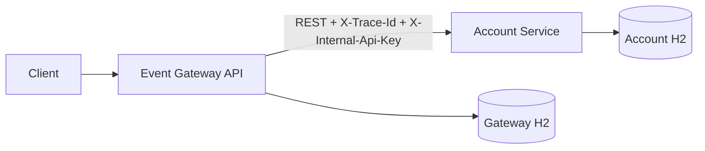

# BMAD Architecture

## System Context

## Service Boundaries

Gateway owns public event intake, validation, event persistence, lifecycle state, resiliency around downstream calls, and event queries. Account Service owns account state, transaction history, balance calculation, internal authentication, and account queries.

The services do not share databases, caches, memory, or application state. Synchronous REST is the only service-to-service communication mechanism.

## Data Ownership

Gateway database:

- `events`
- Unique `event_id`
- Index on `(account_id, event_timestamp)`

Account database:

- `accounts`
- `transactions`
- Unique `transactions.event_id`
- Indexes on account identifiers

Transaction history is the source of truth. Account balance is materialized for efficient reads.

## Request Flow

1. Gateway receives a transaction event.
2. Gateway validates payload and trace context.
3. Gateway persists event as `RECEIVED`.
4. Gateway updates status to `PROCESSING`.
5. Gateway calls Account Service with trace ID and internal API key.
6. Account Service idempotently applies the transaction.
7. Gateway marks the event `APPLIED` or `FAILED`.

## Resiliency

Gateway uses configured connection/read timeouts, bounded retries with exponential randomized backoff, and a circuit breaker. Retry is limited to transient Account Service failures and does not retry validation/client failures. Account Service idempotency makes retry safe.

## Observability

Both services emit JSON logs, health checks, Prometheus-compatible metrics, and OpenAPI documentation. Trace IDs are propagated through request headers and MDC logging.

## Security

Account Service rejects missing or invalid `X-Internal-Api-Key`. Secrets are supplied by environment variables. Request size is limited. Client errors are safe and do not expose stack traces.

## Production Evolution

The current shape supports a clean path to PostgreSQL, Flyway/Liquibase, Kubernetes, OpenTelemetry Collector, Jaeger/Tempo, Prometheus/Grafana, managed secrets, async event processing, DLQ, rate limiting, and contract tests.

